## Taller de eco-robotica (o ecobótica) con micro:bit

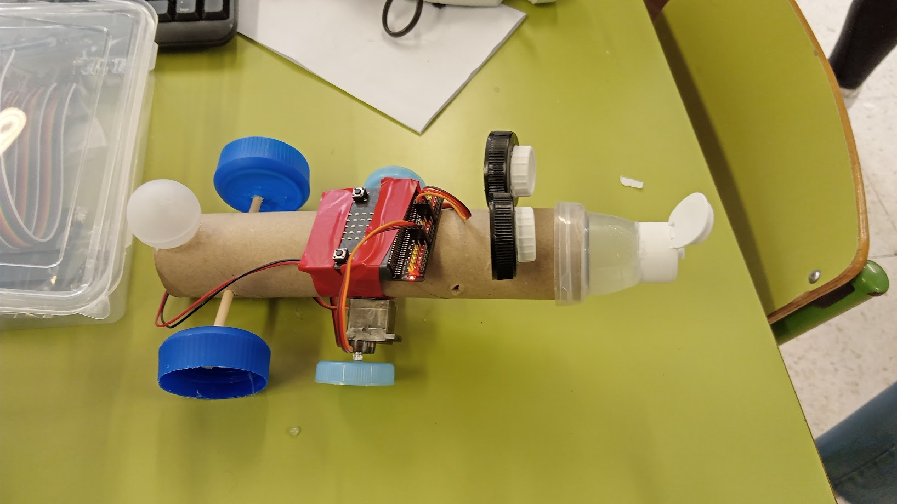

Se trata de una actividad de nivel básico (lo hemos hecho con alumnos sin conocimientos previos, de 5-6 primaria y también de 1-2 ESO)

Trabajamos en grupos de 2 ó 3

### Materiales (por grupo):

* 1 micro:bit (18€)
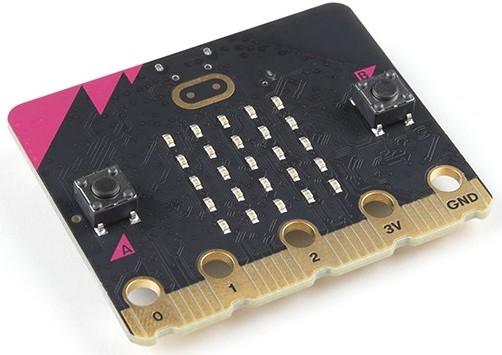
* 1 cable USB micro
* 1 expansor de micro:bit (10€)
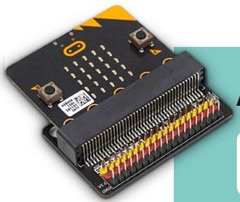
* 2 servos rotación continua (10€)
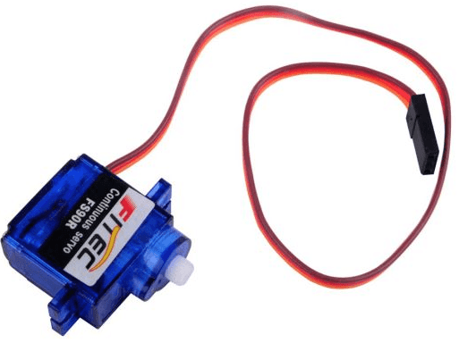
* Led RGB con cable
* 1 portapilas de 2 pilas AA 
* 2 pilas AA

### Materiales comunes

* Tijeras
* Pistolas de pegamento caliente
* Tapones de botellas y de latas
* Cajas pequeñas
* Embalajes de polispam o similar
* Palitos de madera de 0.5mm
* Cinta aislante
* Destornilladores
* Alicates de corte (mejor con supervisión)

Para programar las microbit podemos usar cualquier ordenador conectado a internet.

### Planificación 3 horas en total

* 15-20 minutos Introducción a los robots: ¿qué es un robot?, componentes, programación
* 1 hora aprender a usar micro:bit
    - Emoticonos en la pantalla
    - Uso de botones
    - Control y pruebas con servos
    - Control y pruebas con leds RGB (si hay tiempo)
* 1 hora para crear y montar el prototipo
* 30 minutos para exposición

## Ejemplos

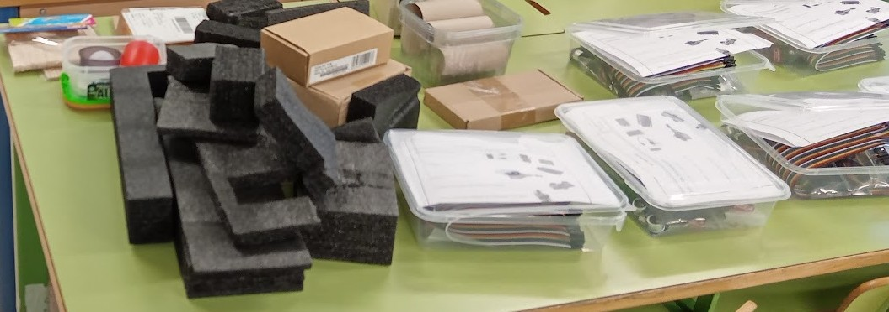
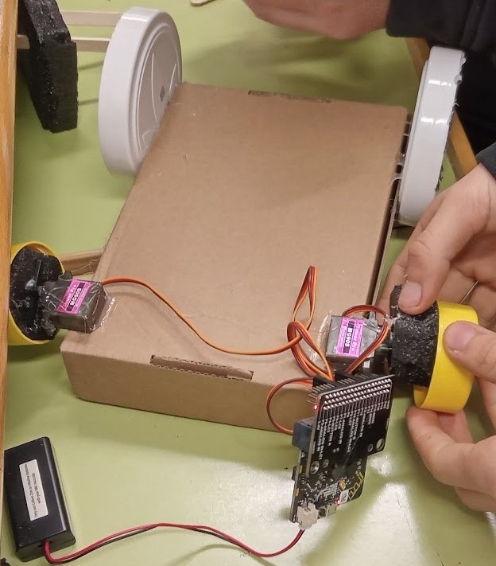
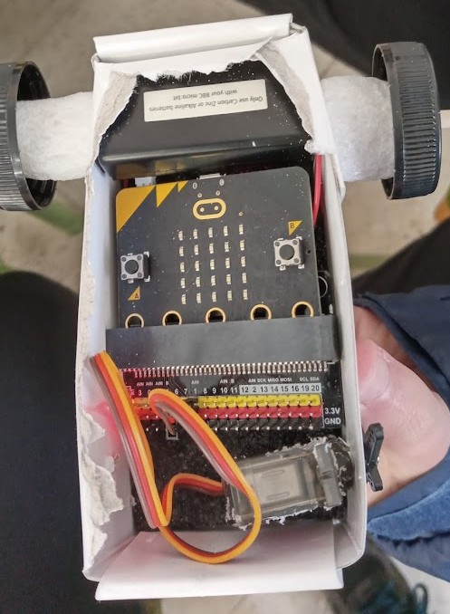
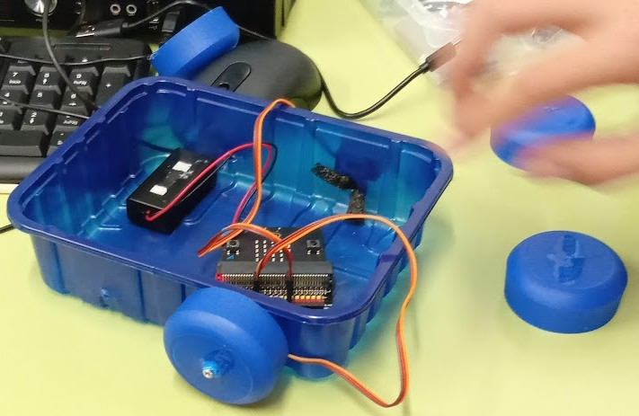
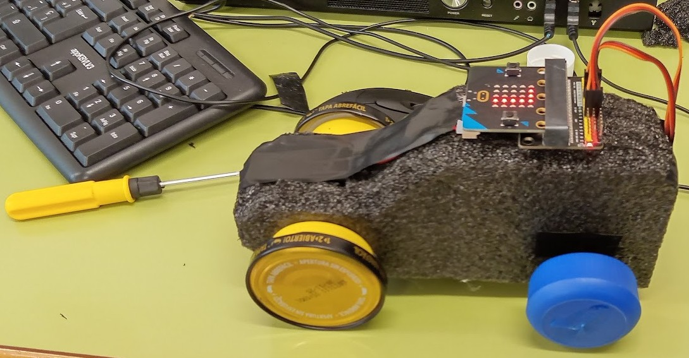
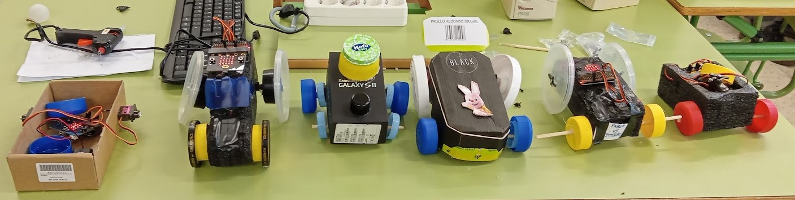
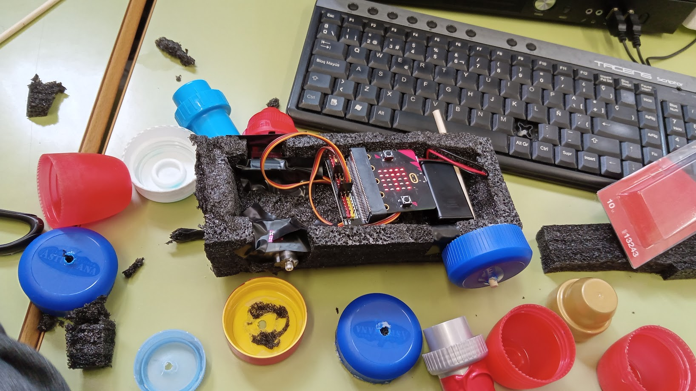

